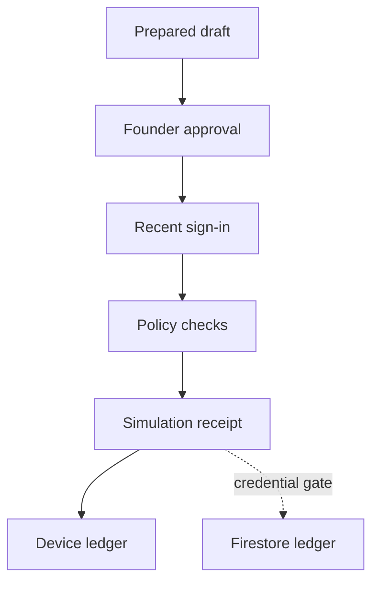

# ANOSA Phase 3 — Controlled Execution Foundation

## Purpose

Phase 3 introduces the authorization and evidence layer that must exist before ANOSA can ever call an external connector. It does not grant autonomous execution. The founder remains the accountable authority, and the production system remains simulation-only.

## Activated sequence

1. **Explicit cloud-ledger gate** — authentication and Firestore persistence are separate controls. `ANOSA_FIRESTORE_LEDGER_ENABLED` stays false until GCP federation and IAM are verified. `ANOSA_EXECUTION_MODE=locked` remains the server-side emergency stop for new simulations.
2. **Step-up authorization** — every execution-intent request requires a recent, verified founder session.
3. **Approval evidence linkage** — an intent must include the SHA-256 receipt from an approved proposal decision.
4. **Exact payload commitment** — the complete draft is hashed before simulation so later mutation is detectable.
5. **Deterministic idempotency** — actor and idempotency key produce a stable intent identifier, preventing accidental duplicate authority.
6. **Connector isolation** — internal, email, task, and GitHub connectors are classified but cannot send, create, merge, publish, deploy, or mutate access.
7. **Tamper-evident intent receipt** — policy result, connector, actor, decision hash, payload hash, timestamp, status, and external-execution boundary receive a final integrity hash.

## Founder flow

No path in Phase 3 reaches an external side effect.

## Server-enforced policy checks

- Founder role and recent verified authentication
- Approved decision integrity receipt
- Exact draft payload present
- Recognized connector class
- Deterministic idempotency key
- Connector isolation
- External execution disabled

Client labels are informative only. The API independently validates the request and generates its own receipt.

## GCP promotion gate

Firestore may be enabled only after all of the following are complete:

- Vercel-to-GCP Workload Identity Federation is configured with short-lived credentials.
- The runtime principal has narrowly scoped create/read permissions for the ANOSA intent and audit collections.
- Development, preview, and production projects are separated.
- Firestore indexes, retention, backup, alerting, and recovery are tested.
- Cloud KMS signing design and key-rotation ownership are approved.
- A production canary proves that an intent and its audit event commit atomically.

Long-lived service-account JSON must never be committed or exposed to the browser.

## Future connector promotion

Each connector requires a separate owner, scopes, rate limit, timeout, retry policy, idempotency contract, consent record, rollback procedure, kill switch, and production approval. Financial transfers, identity adjudication, credential changes, legal commitments, and public announcements require additional dual control and are outside this phase.

## Release acceptance

- The UI displays the simulation-only boundary before and after intent creation.
- The API rejects malformed or unlinked intents.
- Repeated actor/idempotency pairs resolve to the same intent identifier.
- Every accepted simulation receives decision, payload, and final intent hashes.
- No code path invokes an external connector.
- Firestore is attempted only when its explicit credential gate is enabled.
- Lint, TypeScript, production build, smoke tests, deployment, protected-route verification, and runtime error scan pass.
