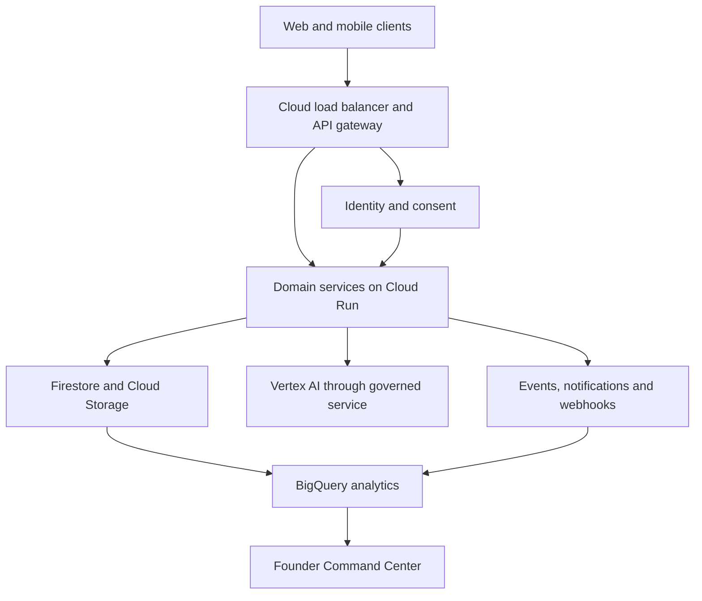

# EGONUX OS v3.0.1 — Enterprise MVP

## Product purpose

EGONUX OS is the shared digital operating system for every future EGONUX institution.

> One Identity. One Wallet. One Marketplace. One Learning Platform. One Community. One Intelligence.

This release is an interactive enterprise sandbox. It proves the information architecture, shared experience and core workflows before regulated financial integrations or production customer data are introduced.

## Current implementation status

The v3.0.1 foundation release provides a production-built Next.js 16 and React 19 interface, the approved EGONUX logo across public and OS navigation, a method-restricted health contract, baseline browser-security headers, CodeQL, dependency maintenance, and automated route smoke tests.

Authentication, MFA, server-enforced roles, persistent profiles, consent records, audit events, payment integrations, and production AI are not implemented yet. The visible identity, wallet, marketplace, learning, community, affiliate, AI, security, and command-center experiences still use local demonstration data.

## What this MVP delivers

| Foundation | Working MVP capability | Production boundary |
| --- | --- | --- |
| Identity | Universal profile, EGONUX ID, KYC journey, trust score, devices and recovery | Connect Firebase Auth, approved KYC provider and consent records |
| Wallet | Multi-currency UI, deposits, transfers, withdrawals, QR and vault workflows | Sandbox only until licences and regulated payment/custody partners are confirmed |
| Marketplace | Product discovery, category filters, vendor presentation and cart actions | Connect orders, verified vendors, payments, reviews and delivery providers |
| Learn | Courses, learning paths, progress, assessments and credential concepts | Persist progress, media and signed certificate records |
| Community | Groups, channels, discussions, announcements and events | Add moderation, messaging, reporting and notification services |
| Affiliate | Verified link, campaign assets, performance and payout workflow | Single-tier pilot; additional reward structures require legal approval |
| AI | Permission-aware assistant demo for finance education, business and learning | Connect Vertex AI through a governed server layer with evaluation and audit logs |
| Command Center | User, revenue, wallet, learning, affiliate, risk and system-health views | Connect BigQuery metrics, alerting, case management and role-restricted operations |
| Security | Zero Trust controls, device trust, audit events, detection and recovery posture | Complete threat modelling, key management, monitoring, testing and evidence collection |
| Developer Platform | API catalog, test credentials, SDK entrypoints and webhooks | Publish versioned Cloud Run APIs, OAuth, quotas and developer documentation |

## Shared architecture

Every domain service must reuse the same identity, authorization, audit, analytics, notification and security contracts. New institutions plug into these contracts instead of creating separate identity or data silos.

## Target technology stack

- Web: Next.js 16, React 19 and TypeScript
- Mobile: Flutter for Android and iOS
- Identity: Firebase Authentication with MFA and custom claims
- Operational data: Firestore
- Files and media: Cloud Storage
- Server workloads: Cloud Functions and Cloud Run
- AI: Vertex AI behind a permission-aware service boundary
- Analytics: BigQuery
- Security: IAM, Cloud KMS, Secret Manager and Cloud Armor
- Operations: Cloud Monitoring, Logging and audited incident workflows

## Security and regulatory guardrails

1. No real deposits, withdrawals, transfers, custody or exchange activity is enabled in this MVP.
2. No customer financial data, identity documents or biometric data should be placed in demo fixtures.
3. Administrative access must be role-based, MFA-protected, time-bounded where possible and fully logged.
4. Server-side authorization is mandatory; hiding a control in the interface is not an authorization decision.
5. AI access is deny-by-default and consent-scoped. Sensitive context is never sent directly from the browser to a model provider.
6. Affiliate rewards are single-tier and campaign-based in the pilot. Earnings are never guaranteed.
7. Payment, lending, investing, insurance and other regulated modules remain feature-flagged until applicable Uganda and target-market requirements are confirmed.
8. “Military-grade” is an operating mindset, not a certification claim. EGONUX must verify continuously, compartmentalize access, rehearse recovery and retain evidence.

## Production implementation sequence

### Phase 1 — Foundation

- Firebase Authentication, MFA, recovery and role claims
- Consent ledger, KYC provider integration and identity audit stream
- Shared design system, accessibility baseline and API contracts
- CI quality gates, secrets management and environment separation

### Backend foundation status

The first v3.0.1 backend branch establishes Firebase client/server configuration,
secure server-issued session cookies, server-enforced role claims, consent records,
append-only audit events, deny-by-default Firestore rules, and emulator-backed rule
tests. These capabilities remain sandbox-only until approved Firebase and Google
Cloud environments are configured and operational security review is complete.

Set `EGONUX_AUTH_REQUIRED=true` only after the approved Firebase project and
server credentials are configured. When enabled, `/os` requires a verified
HTTP-only session and enterprise navigation is filtered using server-verified
role claims. The default remains an explicitly labelled sandbox preview.

### Phase 2 — Transaction-safe core

- Double-entry sandbox ledger with idempotency and reconciliation
- Regulated mobile-money/payment partner integration
- Vendor onboarding, order management and learning persistence
- Event bus, notification preferences and support case management

### Phase 3 — Intelligence and command

- BigQuery event model and trusted executive metrics
- Vertex AI gateway, evaluations, human escalation and prompt/version registry
- Fraud decision service, review queues and immutable evidence
- SLO dashboards, disaster-recovery tests and operational runbooks

### Phase 4 — Institutional expansion

Add Bank, Investments, Exchange, Insurance, University, Innovation Lab, Healthcare, Data Centers, Global Operations, Research Institute and Foundation as governed modules on the same shared foundation.

## Acceptance criteria for this release

- `/os` renders a responsive dashboard across desktop and mobile layouts.
- Every core and enterprise module is navigable without a page reload.
- Wallet actions validate inputs and remain visibly sandboxed.
- Marketplace, Learn, Community, Affiliate and AI have demonstrable interactions.
- Founder Command Center contains the requested core metrics and risk/health signals.
- `/api/health` accepts `GET` only and returns the sandbox version, status and capability list without caching.
- The public website exposes canonical, social, manifest, robots and sitemap metadata using the approved brand asset.
- Lint, TypeScript, production build and production-route smoke checks pass in CI.
